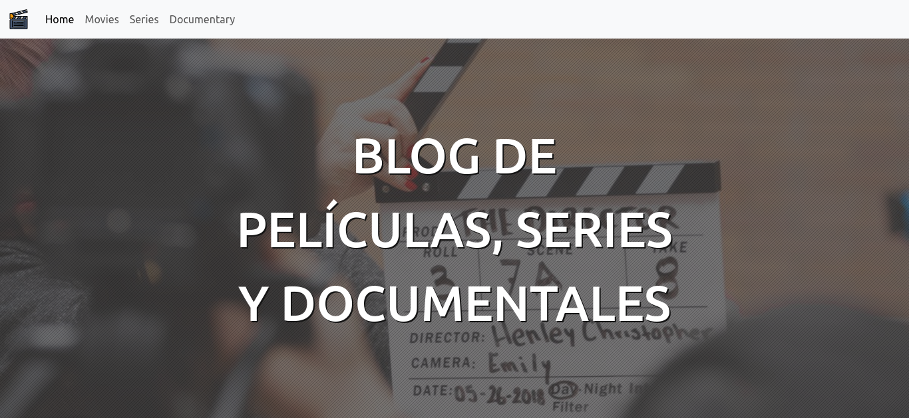

# Blog Media Info

_Proyecto para mostrar información sobre películas, series y documentales._

## Comenzando 🚀

Para descargar (clonar) este repositorio debes ejecutar en tu cónsola:

```hash
git clone https://github.com/apinango70/media_info
```

### Pre-requisitos 📋

Para ejecutar este proyecto, debes tener instalado ruby

```hash
https://rubyinstaller.org/
```

Luego de instalar ruby, debes instalar la gema bundler

```hash
gem install bundler
```

Instalar la gema rails

```hash
gem install rails
```

Instalar postgresql

```hash
https://www.postgresql.org/
```

### Instalación 🔧

Para ejecutar localmente este proyecto, debes garantizar que todas las dependencias de gemas estén configuradas correctamente, para eso debes ejecutar

```hash
bundler install
```

Una vez que has actualizado todas las gemas, corre el servidor

```hash
rails s
```

## Despliegue 📦

Puedes hacer deploy de este proyecto en servicios tipo heroku o netlify, no puede desplegarse en Github Pages.

## Construido con 🛠️

Para el desarrollo de este proyecto se utilizaron las sigientes heramientas

* [Ruby 3.1.2](https://www.ruby-lang.org/es/)
* [Rails 7.0.6](https://rubyonrails.org/)
* [Bootstrap 5.3](https://getbootstrap.com/docs/5.3/getting-started/download/)
* [Postgresql 14.8](https://www.postgresql.org/)

## Contribuyendo 🖇️

Por favor siéntete libre de enviar pull requests y hacer forks.

## Autores ✒️

* **Alejandro Piñango** - Trabajo Inicial y Documentación - [apinango](https://github.com/apinango70)

## Licencia 📄

Este proyecto está bajo la Licencia (MIT) - mira el archivo [LICENSE.md](LICENSE.md) para detalles

---

Hecho con ❤️ por [apinango70](https://github.com/apinango70) 😊
